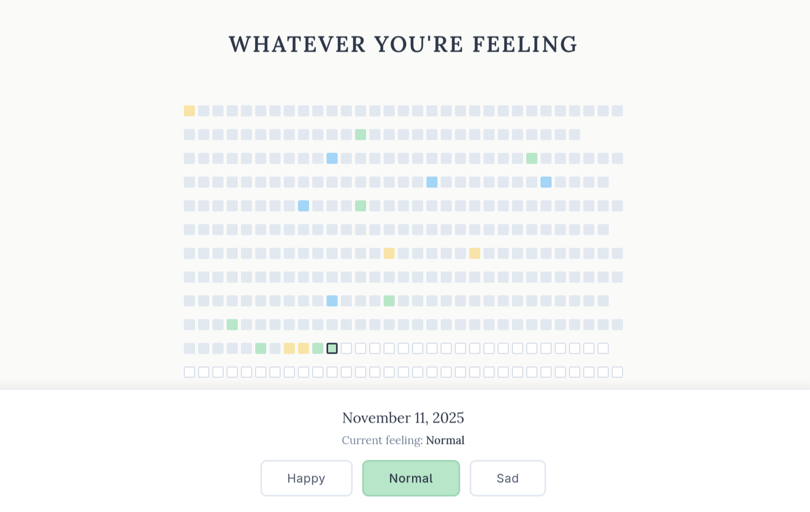

# WYRF - Whatever you're feeling

A simple web application for tracking your daily feelings throughout the week.
  
## Features

- Track your feelings for each day of the week
- Three feeling states: Happy , Normal , Sad
- Clean, intuitive UI with weekly grid view
- In-memory data storage (no database required for this version)
- RESTful API architecture

## Architecture

```
WYRF/
├── backend/              # Go backend API
│   ├── cmd/server/       # Application entry point
│   ├── internal/
│   │   ├── handlers/     # HTTP request handlers
│   │   ├── models/       # Data models
│   │   ├── storage/      # In-memory storage
│   │   └── middleware/   # CORS middleware
│   └── go.mod
└── frontend/             # React frontend
    ├── src/
    │   ├── components/   # React components
    │   └── services/     # API client
    └── package.json
```

### Endpoints

#### Get All Feelings

```bash
GET /api/feelings
```

Response:

```json
[
  {
    "date": "2025-11-10",
    "feeling": "happy",
    "updated_at": "2025-11-10T14:30:00Z"
  }
]
```

#### Save a Feeling

```bash
POST /api/feelings
Content-Type: application/json

{
  "date": "2025-11-10",
  "feeling": "happy"
}
```

Valid feeling values: `"happy"`, `"normal"`, `"sad"`

Response:

```json
{
  "message": "Feeling saved successfully"
}
```

#### Health Check

```bash
GET /health
```

Response:

```json
{
  "status": "ok"
}
```

## License

This project is licensed under the Apache License 2.
